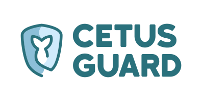

<p align="center">
  
</p>

# CetusGuard

CetusGuard is a tool that protects the Docker daemon socket by filtering calls to its API endpoints.

Some highlights:
 * It is written in a memory-safe language.
 * Has a small codebase that is easy to audit.
 * Has zero dependencies to mitigate supply chain attacks.

## Docker daemon security

Unless you opt in to [rootless mode][1], the Docker daemon requires root and any service with access to its API can escalate privileges. Even in rootless mode, any container with access to the API can escape out of the container, this applies to both Docker and Podman.

The Docker daemon [exposes its API][2] by default through a non-networked Unix socket, which can be restricted by file system permissions, and for networked use the daemon supports being exposed through SSH or TCP with TLS client authentication. However, you still need to fully trust any service you give access to its API.

CetusGuard solves this problem by acting as a proxy between the daemon and the services that consume its API, allowing for example read-only access to some endpoints.

## Usage

CetusGuard is distributed as a Docker image available on [Docker Hub][3] or [GitHub Container Registry][4] and as a statically linked binary available in the [releases section][5] of the project.

A collection of examples for experimenting with CetusGuard, including some real world scenarios with Traefik and Netdata, can be found in the [./examples/](./examples/) directory.

These are the supported options:
```
  -backend-addr string
        Container daemon socket to connect to (env CETUSGUARD_BACKEND_ADDR, CONTAINER_HOST, DOCKER_HOST) (default "unix:///var/run/docker.sock")
  -backend-tls-cacert string
        Path to the backend TLS certificate used to verify the daemon identity (env CETUSGUARD_BACKEND_TLS_CACERT)
  -backend-tls-cert string
        Path to the backend TLS certificate used to authenticate with the daemon (env CETUSGUARD_BACKEND_TLS_CERT)
  -backend-tls-key string
        Path to the backend TLS key used to authenticate with the daemon (env CETUSGUARD_BACKEND_TLS_KEY)
  -frontend-addr value
        Address to bind the server to, can be specified multiple times (env CETUSGUARD_FRONTEND_ADDR) (default ["tcp://127.0.0.1:2375"])
  -frontend-tls-cacert string
        Path to the frontend TLS certificate used to verify the identity of clients (env CETUSGUARD_FRONTEND_TLS_CACERT)
  -frontend-tls-cert string
        Path to the frontend TLS certificate (env CETUSGUARD_FRONTEND_TLS_CERT)
  -frontend-tls-key string
        Path to the frontend TLS key (env CETUSGUARD_FRONTEND_TLS_KEY)
  -log-level int
        The minimum entry level to log, from 0 to 7 (env CETUSGUARD_LOG_LEVEL) (default 6)
  -no-builtin-rules
        Do not load the built-in rules (env CETUSGUARD_NO_BUILTIN_RULES)
  -rules value
        Filter rules separated by new lines, can be specified multiple times (env CETUSGUARD_RULES)
  -rules-file value
        Filter rules file, can be specified multiple times (env CETUSGUARD_RULES_FILE)
  -version
        Show version number and quit
```

## Filter rules

By default, only a few common harmless endpoints are allowed, `/_ping`, `/info` and `/version`.

All other endpoints are denied and must be explicitly allowed through a rule syntax defined by the following ABNF grammar:
```
blank   = ( SP / HTAB )
method  = 1*%x41-5A                             ; HTTP method
methods = method *( "," method )                ; HTTP method list
pattern = 1*UNICODE                             ; Target path regex
rule    = *blank methods 1*blank pattern *blank ; Rule
```

Only requests that match the specified HTTP methods and target path regex are allowed.

There are several variables specified by surrounding `%` that can be used to construct rule patterns, the full list and values can be found in the [`rule.go`](./cetusguard/rule.go) file.

Lines starting with `!` are ignored.

Some example rules are:
```
! Ping
GET,HEAD %API_PREFIX_PING%

! Get version
GET %API_PREFIX_VERSION%

! Get system information
GET %API_PREFIX_INFO%

! Get data usage information
GET %API_PREFIX_SYSTEM%/df

! Monitor events
GET %API_PREFIX_EVENTS%

! List containers
GET %API_PREFIX_CONTAINERS%/json

! Inspect a container
GET %API_PREFIX_CONTAINERS%/%CONTAINER_ID_OR_NAME%/json
```

## License

[MIT License](./LICENSE.md) © [Héctor Molinero Fernández](https://hector.molinero.dev).

[1]: https://docs.docker.com/engine/security/rootless/
[2]: https://docs.docker.com/engine/security/protect-access/
[3]: https://hub.docker.com/r/hectorm/cetusguard
[4]: https://github.com/hectorm/cetusguard/pkgs/container/cetusguard
[5]: https://github.com/hectorm/cetusguard/releases
